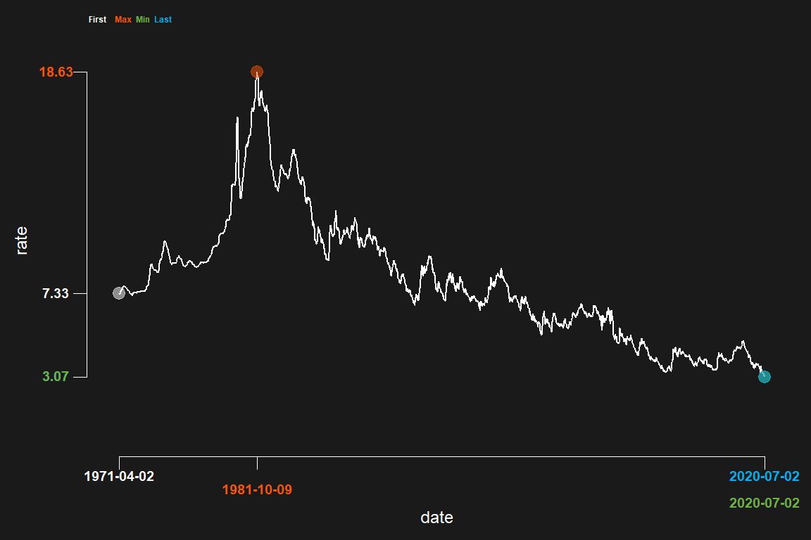

<!-- README.md is generated from README.Rmd. Please edit that file -->

# darklyplot

<!-- badges: start -->

<!-- badges: end -->

The goal of darklyplot is to create simple time series plots with a dark
background. The miniminum and maximum values are highlghted, and color
coded along with the y axis and x axis labels.

## Installation

You can install the development version of darklyplot from
[GitHub](https://github.com/) with:

``` r
# install.packages("devtools")
devtools::install_github("lenkiefer/darklyplot")
```

## Examples

This is a basic example which shows you how to solve a common problem:

``` r
library(darklyplot)
darklyplot(df=mtg_rate,column="rate",labelx="roundx",n.decimals=3)
```

 You can vary
the chart look with several parameters:

``` r
darklyplot(df=mtg_rate,
          column="rate",
          col="white",  #can use R color names or hex 
          n.decimals=0,
          refline=TRUE,
          refValue=5,
          refCol="purple",
          shade=TRUE,
          shadeCol="#fe5305",
          shadeAlpha=0.35,
          minCol="blue",
          maxCol="red",
          firstCol="orange",
          lastCol="pink",
          labelx="round",
          Ndodge=2)
```

 Will work
with any dataframe with a numberic column and a date index:

``` r
set.seed(20200704)
df_test=data.frame(date=seq.Date(from=as.Date("2020-01-01"),to=as.Date("2020-06-30"),by="1 day"))
df_test$random_variable=rnorm(NROW(df_test),0,1)
darklyplot(df=df_test,column="random_variable",n.decimals=2)+labs(title="A Random Variable")
```


